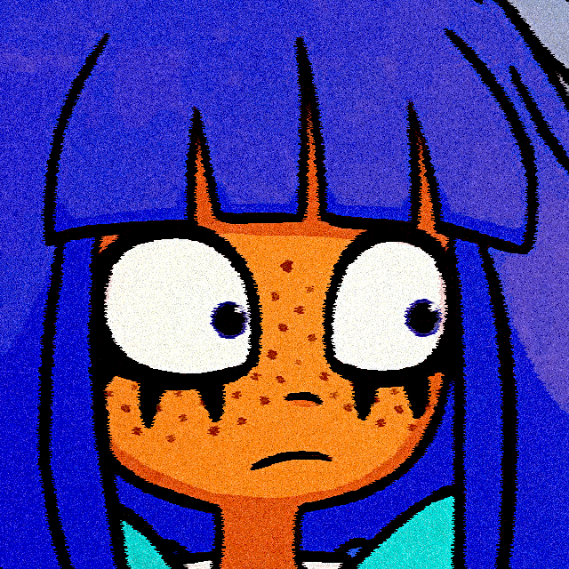

# Having Fun while learning Raylib

I'm just trying to learn how to make multimedia programs with raylib and C, I'll try to use pure C.

## Projects
+ block: game about a single block doing different kinds of stuff, right now it just seeks a randomly spawned pill.
+ rectangles: it's pretty much just a graphics lab.

## Dependencies
+ raylib

## Build 
`mkdir bin`
`clang -o bin/FILENAME FILENAME.c [optional LIB.c] -lraylib`